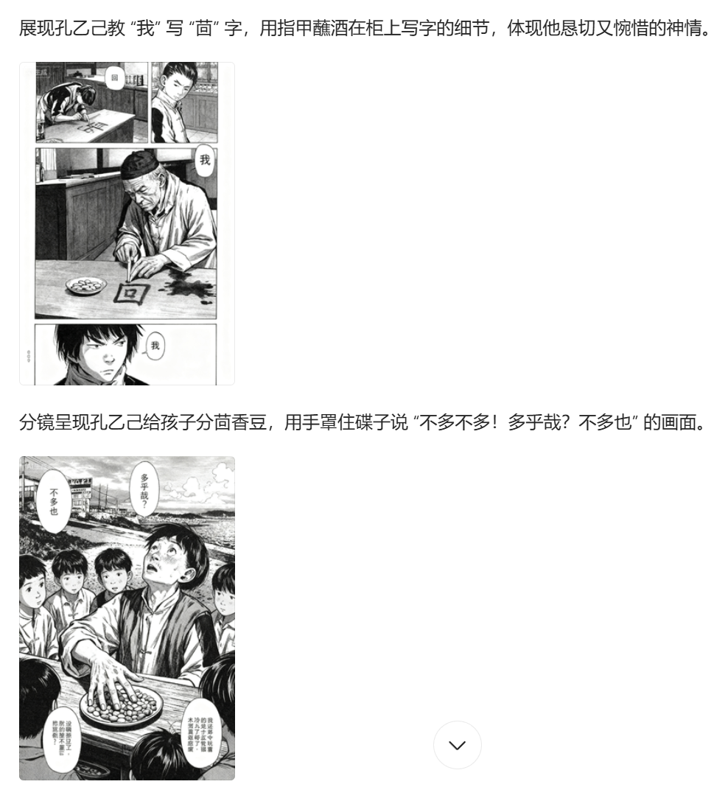
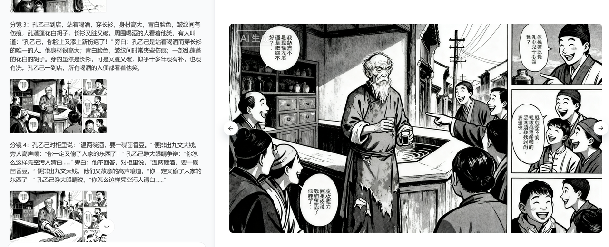
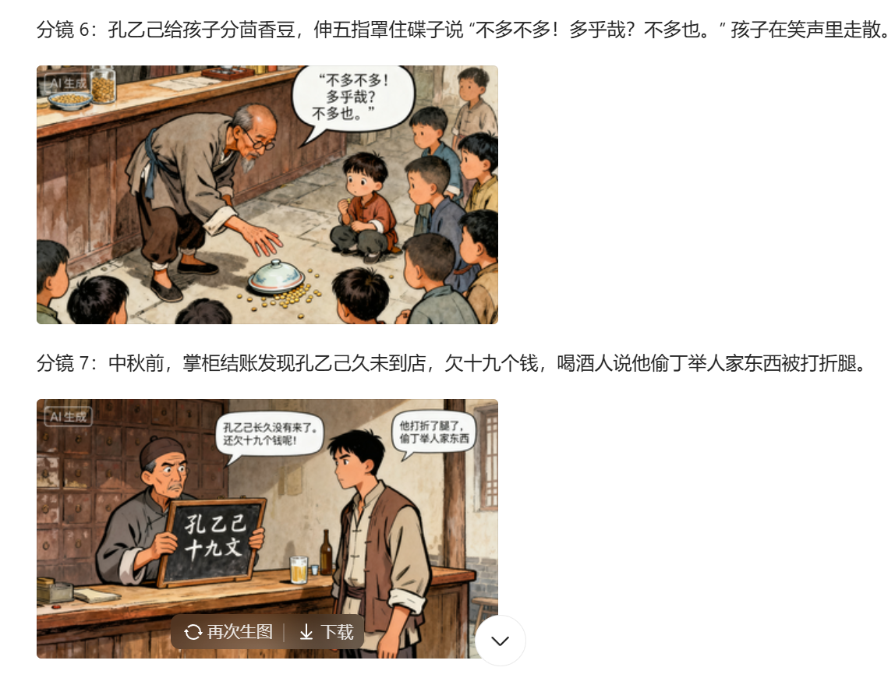
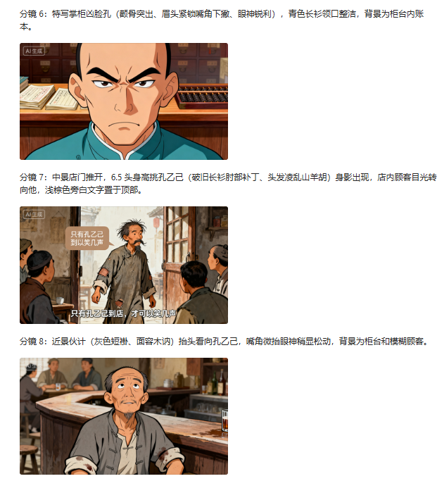

# Prompt调优过程综述

## 项目背景与目标
**核心目标**：将小说转换为连贯漫画分镜，实现场景统一、人物稳定、情节精准视觉化呈现

**关键技术挑战**：
- 场景转换与分段
- 画面一致性保持
- 分镜设计合理性
- 人物特征稳定性

---

## Prompt演进的思考路径

###  第一版：基础框架建立

#### 设计思路
从最基础的功能需求出发，建立自动分段和跨分镜关联机制。

#### Prompt核心结构
```
漫画分镜生成约束条件要求：
├── 文章片段划分规则
├── 分镜生成逻辑
├── 核心约束（最高优先级）
└── 输出格式
```

#### 关键设计决策
1. **场景自动识别**：基于地点变更、时间跳跃、环境突变划分片段
2. **跨分镜关联**：通过"场景属性继承清单"确保连续性
3. **三层约束体系**：背景统一、人物稳定、物品守恒

#### 测试反馈与问题
```
 优点：
- 实现场景自动分段
- 建立基础约束框架

 不足：
- 一个片段只生成一张图片
- 人物特征跨片段不一致（长胡子→短胡子）
```
#### 生成图结果
- 
---

###  第二版：多格分镜与角色卡机制

#### 设计思路升级
针对第一版的核心问题，引入角色卡预锁定和多格分镜设计。

#### Prompt核心改进
```
AI漫画分镜生成约束条件（增强版）：
├── 一、角色卡预生成机制 (新增)
│   ├── 角色信息智能提取
│   └── 角色卡输出与确认
├── 二、文章片段划分规则 (强化)
├── 三、多格分镜生成规范 (全新)
│   ├── 分镜数量与内容分配
│   └── 分镜画面设计规则
└── ...其他模块
```

#### 关键创新点
1. **角色卡预生成**：锁定人物视觉设定，用户可微调确认
2. **多格分镜设计**：根据情节密度分配1-3格/200-300字
3. **镜头语言引入**：近景、中景、远景搭配强化节奏感

#### 测试反馈与问题
```
 优点：
- 角色卡解决人物一致性问题
- 场景转换时背景保持稳定

 不足：
- 画面文字非常模糊
- 配角人脸形象潦草
```
#### 生成图结果
- 
---

###  第三版：文字规范与配角处理

#### 设计思路精细化
针对文字清晰度和配角形象问题，建立详细的文字呈现规范。

#### Prompt核心新增
```
四、文字呈现规范 (新增核心要求)
├── 对话文字
│   ├── 清晰度：无衬线体，字号≥5%画面高度
│   ├── 完整性：忠于原文，语义断点换行
│   └── 位置适配：靠近说话人物，避免遮挡
├── 旁白与说明文字
│   ├── 格式区分：前缀+灰色调
│   └── 信息简洁：仅保留关键信息
└── 特殊文字处理
    ├── 强调内容：加粗/描边/变色
    └── 符号规范：标点完整呈现
```

#### 配角处理机制
```
次要人物处理规则：
├── 非核心角色：随机生成正常人脸
├── 生理逻辑匹配：年龄、性别符合原文
└── 视觉区分度：与核心人物形成差异
```

#### 测试反馈与问题
```
 优点：
- 文字清晰度问题解决
- 配角形象更加自然

 不足：
- 彩色/黑白未规范，色彩虚假
- 场景过于宏大，缺乏漫画分镜感
- 对话框位置混乱
```
#### 生成图结果
- 
---


###  第四版：战略调整与模块化

#### 设计思路根本性转变
认识到技术边界限制，从"整本生成"转向"分章生成"。

#### 战略调整决策
```
核心目标调整：
├── 原目标：整本小说直接生成漫画
├── 问题：一次性功能过多，模型边界问题严重
└── 新方向：分章生成 + 模块化处理
```

#### Prompt架构重构
```
#AI小说转漫画综合指南
├── 一、小说内容筛选与处理 (全新)
│   ├── 故事节点获取 (GPT深度解析)
│   ├── 对话简化处理 (A/B/C分类)
│   └── 视觉元素优先级分配 (40/30/20/10)
├── 二、角色卡预生成机制 (保留)
├── 三、文章片段划分规则 (保留)
├── 四、多格分镜生成规范 (增强)
│   ├── 分镜衔接方式 (动作匹配)
│   ├── 摄像机手法 (Dutch angle等)
│   └── 参考对比风格 (进击的巨人等)
├── 九、工具推荐与应用流程 (全新)
└── 十、质量检查清单 (新增)

```

#### 关键技术创新
1. **剧情分析环节**：GPT深度解析"起承转合"
2. **对话分类处理**：
   - A类：推动情节的关键台词
   - B类：日常对话转为分镜脚本
   - C类：环境描述转为分镜描述
3. **视觉优先级**：关键帧40%、过程帧30%、结果帧20%、环境帧10%
4. **Prompt输入拆分**：分多次输入，减少单次信息量

#### 测试方法与结果
```
测试方法改进：
├── 一次性测试：prompt规模过大，注意力涣散
└── 分多次测试：功能分离输入，但输出凌乱

解决方案方向：
├── 引入memory（记忆）功能
└── 引入summary（总结）功能
```
#### 生成图结果
- 
---
