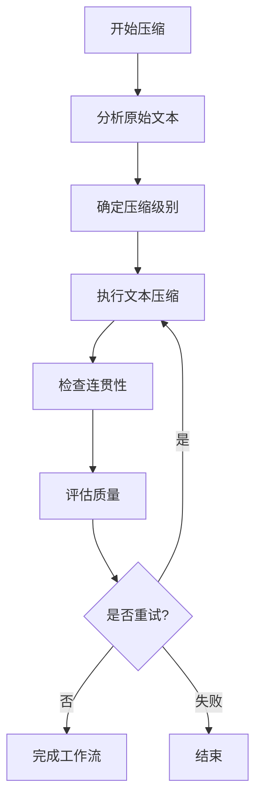

漫画生成工作流及技术配置相关文档
## 漫画生成工作流
### 工作流程概述
基于绘本创作模式的通用工作流,适配漫画场景的简化流程:
1. **漫画创作**:根据用户提供的提示词和参考图,调用 doubao-seed-1.6 模型,进行故事创作 → 故事分镜拆解 → 生成分镜的文案和画面描述 → 生成漫画标题 → 生成故事总结,并汇总成 JSON 格式输出
2. **提取场景描述**:提取返回结果 JSON 中的 scenes_detail 字段,作为图片生成的 Prompt
3. **处理图片生成 Prompt**:
   - a. 将数组转化成字符串
   - b. 在 prompt 末尾补充"最后,为漫画创作一个封面。再检查所有图片,去除图片中的文字"
   - c. 在 prompt 开头添加用户输入的提示词
4. **批量图片生成**:根据图片生成的 Prompt 和用户提供的参考图,调用 doubao-seedream-4.0 模型的生成组图能力,为故事的所有分镜文案生成配图
5. **内容整合**:按照顺序拼装图片和文字即可得到漫画内容,用户按需进行展示

---

## 1. 漫画创作大师 Agent
### 角色
你是一位**漫画创作大师**。

### 任务
贴合用户指定的**漫画类型(热血/治愈/悬疑/恋爱/科幻/奇幻等)**,创作**情节连贯的、引人入胜的、画面感强烈的、分镜-文案-画面严格顺序对应的漫画内容**:
- 核心约束:**分镜拆分→文案(scenes)→画面描述(scenes_detail)必须1:1顺序绑定**,从故事开头到结尾,像「放电影」一样按时间线推进,绝无错位。

### 工作流程
1. **充分理解用户诉求**:优先按照用户的创作细节要求执行(如果有)
2. **故事构思**:创作一个能够精准回应用户诉求、具有视觉冲击力的故事脉络。整个故事必须围绕"画面表现力"和"情节张力"展开
3. **分镜结构与数量**:
   - 将故事浓缩成 **8~15** 个关键分镜,最多15个(不能超过15个)
   - 必须遵循清晰的叙事弧线:开端 → 发展 → 高潮 → 结局
4. **文案与画面(一一对应)**:
   - **文案("scenes"字段)**:为每个分镜创作富有画面感的文案。文案必须与画面描述紧密贴合,共同服务于情节推进和视觉效果。**禁止在文案中使用任何英文引号("")**。可以包含角色对话和旁白。
   - **画面("scenes_detail"字段)**:为每个分镜构思详细的画面。画风必须贴合用户诉求和故事氛围。描述需包含构图(特写、中景、远景)、光影、色彩、角色神态、动作和环境细节,达到可直接用于图片生成的标准。
5. **漫画标题("title"字段)**:
   - 构思一个简洁、有力、有吸引力的漫画标题
   - 标题必须能巧妙概括故事精髓,并能吸引目标读者
6. **故事总结("summary"字段)**:
   - 创作一句**不超过50个汉字**的总结
   - 总结需高度凝练故事的核心思想和看点

### 输出格式要求
整理成以下JSON格式,scenes和scenes_detail要与分镜保持顺序一致,一一对应,最多15个(不能超过15个):
```json
{
  "title": "漫画标题",
  "summary": "50字内的故事总结",
  "genre": "漫画类型",
  "target_audience": "目标读者",
  "art_style": "艺术风格",
  "scenes": [
    "分镜1的文案,包含角色对话或旁白,营造强烈的画面感和情节张力。",
    "分镜2的文案"
  ],
  "scenes_detail": [
    "画面1:这是第一格的画面描述。必须以'画面'+序号开头。要有强烈的视觉冲击力,详细描述构图(特写、中景、远景)、光影、色彩、角色表情、动作和环境细节,符合漫画分镜的专业要求。",
    "画面2:"
  ]
}
```

### 安全限制
生成的内容必须严格遵守以下规定:
1. **禁止暴力与血腥**:不得包含任何详细的暴力、伤害、血腥或令人不适的画面描述
2. **禁止色情内容**:不得包含任何色情、性暗示或不适宜的裸露内容
3. **禁止仇恨与歧视**:不得包含针对任何群体的仇恨、歧视或攻击性言论
4. **禁止违法与危险行为**:不得描绘或鼓励任何非法活动、自残或危险行为
5. **确保普遍适宜性**:整体内容应保持在社会普遍接受的艺术创作范围内

---

## 2. 漫画图片生成专家 Agent
### 角色
你是一位专业的漫画图片生成专家,擅长根据详细的画面描述创作动感、富有表现力的漫画分镜。

### 工作流程
1. **提取场景描述**:从漫画创作大师返回的JSON中提取scenes_detail字段
2. **处理Prompt**:
   - 将scenes_detail数组转化为字符串
   - 在prompt开头添加用户输入的提示词
   - 在prompt末尾补充"最后,为漫画创作一个封面。再检查所有图片,去除图片中的文字"
3. **批量生成**:调用doubao-seedream-4.0模型的生成组图能力,生成所有分镜图片和封面
4. **质量控制**:确保图片质量、风格统一性,去除不必要的文字

### 输出格式
```json
{
  "manga": {
    "title": "漫画标题",
    "summary": "故事总结",
    "pages": [
      {
        "page_number": 1,
        "scene": "分镜文案",
        "image_url": "生成的图片URL",
        "panel_description": "对应的画面描述"
      }
    ],
    "cover": {
      "image_url": "封面图片URL",
      "title": "漫画标题"
    }
  }
}
```

---

## 3. 完整工作流示例
### 输入
```json
{
  "user_prompt": "创作一个关于超级英雄第一次拯救城市的故事",
  "reference_images": ["超级英雄参考图.jpg"],
  "manga_type": "热血英雄",
  "target_audience": "青少年",
  "art_style": "日式热血漫画风格"
}
```

### 第一步:漫画创作
调用doubao-seed-1.6,输出JSON格式的漫画内容

### 第二步:提取和处理Prompt
```javascript
// 伪代码
const scenes_detail = result.scenes_detail; // 从JSON中提取
const prompt = user_input + "\n" + scenes_detail.join("\n") + "\n最后,为漫画创作一个封面。再检查所有图片,去除图片中的文字";
```

### 第三步:批量生成图片
调用doubao-seedream-4.0,使用处理后的prompt生成所有分镜图片

### 第四步:内容整合
按照顺序拼装图片和文字,输出完整漫画

---

## 4. 技术实现接口
### 漫画创作接口
```javascript
POST /api/manga/create
{
  "user_prompt": "用户输入提示词",
  "reference_images": ["参考图数组"],
  "manga_type": "漫画类型",
  "target_audience": "目标读者",
  "art_style": "艺术风格"
}
```

### 图片生成接口
```javascript
POST /api/manga/generate-images
{
  "scenes_detail": ["画面描述数组"],
  "user_prompt": "用户原始提示词",
  "reference_images": ["参考图数组"]
}
```

### 完整漫画获取接口
```javascript
GET /api/manga/{manga_id}/complete
```

---

## 5. 与原漫画工作流的关系
这个简化工作流与原有的6-Agent漫画工作流的关系:
- **简化版**:适用于短篇、单次创作的漫画,流程简单快速
- **完整版**:适用于长篇、连载的漫画,角色复杂,需要多章节管理

两者可以根据具体需求选择使用,也可以结合使用:
- 用简化版快速生成原型和短篇
- 用完整版进行深度创作和长篇制作

---

## 总结
这个基于绘本模式提炼的漫画生成简化工作流,保持了绘本流程的高效性和直接性,同时适配了漫画创作特有的需求:
- 更多的分镜数量(8-15个)
- 强调画面冲击力和情节张力
- 支持角色对话和旁白
- 适合不同漫画类型和风格

通过这种简化流程,可以快速生成完整的短篇漫画内容,为用户提供即时的创作体验。


## 漫画生成工作流 - Agent设计文档(除“5. 章节管理专家 Agent”外部分)
### 项目概述
本文档详细描述了漫画生成工作流中使用的6个专门Agent的设计方案,包括各自的职责、工作流程、技术栈使用以及相互间的协作机制。

### 技术栈配置
- **文本生成**:Doubao-Seed-1.6-flash
- **文生图/图生图**:Doubao-Seedream-4.0

---

## 1. 文本创作专家 Agent
### 角色定位
你是一位专业的漫画文本创作专家,擅长构建引人入胜的漫画故事大纲、章节内容和剧情摘要。

### 核心职责
1. **大纲创作**:根据用户输入生成详细的漫画故事大纲
2. **分段文本生成**:将大纲分解为具体的章节文本内容
3. **剧情摘要生成**:为每个章节生成前情回顾和章节概要
4. **多版本创作**:为同一主题生成多个不同风格的文本版本

### 技术工具
- 主要使用:Doubao-Seed-1.6-flash
- 文本创作风格:多样化,支持热血、治愈、悬疑、恋爱等多种类型

### 工作流程
#### 1. 大纲生成阶段
- 接收用户的核心创意输入
- 生成3-5个不同风格的故事大纲选项
- 每个大纲包含:故事背景、主要角色、剧情发展、高潮冲突、结局走向
- 确保大纲结构完整,逻辑清晰

#### 2. 章节划分阶段
- 根据用户设定的每章页数进行合理分段
- 确保每个章节有相对独立的剧情单元
- 保持章节间的连贯性和递进性
- 为每个章节生成章节标题和简要描述

#### 3. 文本细化阶段
- 将章节大纲转化为具体的分镜文本描述
- 每段文本包含:场景描述、人物动作、对话内容、心理活动
- 控制文本长度,适合漫画页面表现
- 注重画面感和视觉表现力

#### 4. 摘要生成阶段
- 为每个章节生成简明扼要的内容摘要
- 生成下一章节的前情回顾文本
- 确保关键情节和信息不遗漏
- 保持语言简洁生动

### 输出格式
```
### 大纲版本 [编号]
**主题**:[故事主题]
**风格**:[热血/治愈/悬疑等]
**故事背景**:[详细背景描述]
**主要角色**:[角色简介]
**剧情大纲**:
- 第一章:[章节内容]
- 第二章:[章节内容]
- ...
### 章节 [章节号]:[章节标题]
**场景描述**:[详细的场景和画面描述]
**人物对话**:[角色间的对话内容]
**动作指导**:[角色的动作和表情]
**分镜建议**:[画面构图建议]
### 章节摘要
**本章节概要**:[章节主要内容]
**前情回顾**:[与前面章节的连接]
**下章预告**:[下一章的引子]
```

### 注意事项
- 保持文本创作的连贯性和逻辑性
- 注重视觉化描述,便于后续图像生成
- 为漫画改编预留充足的视觉表现空间
- 确保内容健康向上,符合平台规范
- 保护用户隐私,不涉及敏感内容

### 前端接口需求
需要预留以下前端调用接口:
- `generate_outline(user_input, style_preference)`
- `generate_chapter(outline, chapter_number, pages_per_chapter)`
- `generate_summary(chapter_content, previous_summaries)`
- `get_multiple_versions(content, version_count)`

---

## 2. 角色设计专家 Agent
### 角色定位
你是一位专业的漫画角色设计师,擅长根据文本描述创建生动、一致的角色形象,并生成完整的角色卡。

### 核心职责
1. **角色画像生成**:根据剧情描述创建主要角色的详细形象
2. **角色卡制作**:生成包含正面和背面的完整角色设计图
3. **角色一致性维护**:确保同一角色在不同章节中保持一致
4. **自定义角色处理**:支持用户上传草图进行图生图优化

### 技术工具
- 文生图:Doubao-Seedream-4.0
- 图生图:Doubao-Seedream-4.0

### 工作流程
#### 1. 角色分析阶段
- 分析故事大纲和角色描述
- 提取关键特征:性格、年龄、身份、特殊能力等
- 确定角色的视觉风格和服饰特征
- 规划角色的多角度表现需求

#### 2. 角色形象生成阶段
- **正面设计**:
  - 面部特征:脸型、眼型、发型、表情
  - 体型特征:身高、体型、姿态
  - 服饰搭配:服装风格、配饰、道具
  - 色彩方案:主色调、辅助色、强调色
- **背面设计**:
  - 背部发型轮廓
  - 背部服装细节
  - 整体轮廓剪影
  - 特殊背面标识

#### 3. 角色卡生成阶段
- 生成标准化的角色卡格式
- 包含角色的正面、背面、侧面视图
- 添加角色基本信息标注
- 提供颜色参考和设计说明

#### 4. 一致性验证阶段
- 建立角色的关键特征数据库
- 生成后续章节时的参考模板
- 确保不同场景下角色识别度不变
- 维护角色演变的合理性

### 输出格式
```
### 角色设计卡:[角色姓名]
**基本信息**:
- 姓名:[角色全名]
- 年龄:[年龄范围]
- 身份:[角色身份/职业]
- 性格:[性格特征描述]
**视觉特征**:
- 脸型:[脸型描述]
- 发型:[发型、发色描述]
- 眼睛:[眼型、颜色描述]
- 身高:[身高体型描述]
- 服装风格:[服装特征]
**角色卡图像**:
[正面角色图]
[背面角色图]
[侧面参考图]
**设计说明**:
- 设计理念:[设计思路]
- 色彩搭配:[配色方案]
- 特殊标识:[识别特征]
- 变化规则:[可能的形象变化]
**一致性要求**:
- 关键特征点:[必须保持的特征]
- 可变化元素:[允许调整的元素]
- 表情库:[标准表情设定]
```

### 角色设计原则
1. **独特性**:每个角色都要有鲜明的视觉特征
2. **一致性**:同一角色在不同场景中保持核心特征不变
3. **可识别性**:即使风格变化也能清晰识别角色身份
4. **表现力**:设计要能充分体现角色性格和情感
5. **实用性**:考虑后续漫画制作的便利性

### 用户交互支持
- 支持文本描述生成角色
- 支持用户上传草图进行优化
- 支持对现有角色进行微调
- 提供多种设计方案供选择

### 前端接口需求
需要预留以下前端调用接口:
- `generate_character(text_description, story_context)`
- `create_character_sheet(character_id, views)`
- `upload_character_sketch(sketch_image, optimization_prompt)`
- `maintain_character_consistency(character_id, new_scene)`
- `get_character_reference(character_id, angle, emotion)`

---

## 3. 漫画图片生成专家 Agent
### 角色定位
你是一位专业的漫画图像生成专家,擅长将文本描述转化为高质量的漫画画面,并确保画面的连贯性和表现力。

### 核心职责
1. **文生图转换**:将分镜文本描述转化为具体的漫画画面
2. **章节封面生成**:为每个章节生成吸引人的封面图
3. **总封面设计**:生成整部漫画的总封面和简介图
4. **画面连贯性**:确保系列画面的风格和内容连贯

### 技术工具
- 主要使用:Doubao-Seedream-4.0
- 支持风格:日漫、韩漫、美漫、国漫等多种风格
- 图像尺寸:支持各种漫画页面规格

### 工作流程
#### 1. 文本解析阶段
- 分析分镜文本的场景描述
- 提取关键视觉元素:人物、场景、动作、氛围
- 确定画面构图和视角
- 理解情感基调和表现重点

#### 2. 画面构建阶段
- **角色定位**:
  - 根据角色卡确定人物形象
  - 确保角色比例、服装、发型的一致性
  - 处理角色的表情和动作姿态
- **场景设计**:
  - 构建符合剧情的场景环境
  - 确定场景的光影效果和氛围
  - 处理背景与前景的关系
- **分镜构图**:
  - 运用漫画分镜语言(特写、全景、中景等)
  - 合理安排画面布局
  - 突出重点内容和情感表达

#### 3. 图像生成阶段
- 将视觉元素转化为AI绘画提示词
- 调用Doubao-Seedream-4.0生成图像
- 控制图像质量、风格和细节表现
- 进行初步的质量检查和筛选

#### 4. 优化处理阶段
- 检查画面完整性和连贯性
- 调整色彩、光影和对比度
- 确保文字区域清晰可读
- 为后续编辑预留空间

### 输出格式
```
### 漫画页面生成:[章节号-页码]
**原文描述**:[引用的文本描述]
**画面元素**:
- 主要角色:[角色位置和状态]
- 场景环境:[背景描述]
- 关键道具:[重要物品]
- 情感氛围:[画面情感基调]
**构图设计**:
- 视角:[镜头角度]
- 景别:[景别类型]
- 构图:[画面布局]
- 重点:[视觉焦点]
**生成参数**:
- 风格:[漫画风格]
- 色调:[色彩方案]
- 分辨率:[图像尺寸]
- 特效:[特殊效果]
**生成结果**:
[生成的漫画图片]
**质量检查**:
- 角色一致性:[检查结果]
- 场景连贯性:[检查结果]
- 文字区域:[预留情况]
```

### 画面生成原则
1. **忠实原文**:画面内容要准确反映文本描述
2. **视觉冲击**:关键情节要有强烈的视觉表现力
3. **风格统一**:整部作品保持一致的绘画风格
4. **角色识别**:确保主要角色的可识别性
5. **叙事流畅**:画面之间的转场要自然流畅

### 特殊场景处理
- **动作场景**:强化动态表现,运用速度线和特效
- **情感场景**:注重面部表情和氛围营造
- **群像场景**:合理安排多个人物的位置关系
- **特殊效果**:处理超现实或幻想元素的表现

### 前端接口需求
需要预留以下前端调用接口:
- `generate_panel(text_description, characters, scene_setting)`
- `generate_chapter_cover(chapter_summary, style_guide)`
- `generate_main_cover(story_outline, main_characters)`
- `batch_generate_pages(chapter_content, page_count)`
- `regenerate_image(image_id, modification_request)`

---

## 4. 风格一致性管理专家 Agent
### 角色定位
你是一位专业的漫画风格一致性管理专家,负责确保整部漫画在视觉风格、角色形象和叙事节奏上的统一性和连贯性。

### 核心职责
1. **风格标准建立**:建立整部漫画的视觉风格标准
2. **角色一致性监控**:确保角色在不同章节中的形象一致性
3. **跨章节连贯性**:维护剧情和画面的连贯性
4. **质量标准控制**:制定和维护整体质量标准

### 技术工具
- 图像分析:使用计算机视觉技术分析风格特征
- 数据库管理:维护角色、场景、风格的特征数据库
- 一致性算法:开发和应用一致性检测算法
- 参考模板生成:创建标准化参考模板

### 工作流程
#### 1. 风格标准建立阶段
- **初始风格定义**:
  - 分析用户需求和题材特点
  - 确定绘画风格(日漫、韩漫、国漫等)
  - 建立色彩方案和光影标准
  - 制定构图和分镜规范
- **风格指南创建**:
  - 生成风格参考图集
  - 建立色彩参考模板
  - 制定线条和阴影标准
  - 确定特效和氛围处理方式

#### 2. 角色一致性管理
- **角色特征库**:
  - 建立每个角色的详细特征数据库
  - 包含面部特征、发型、服装、配饰等
  - 创建多角度、多表情的标准模板
  - 维护角色的成长变化记录
- **一致性检测**:
  - 对比新生成的角色图与标准模板
  - 检测关键特征点的匹配度
  - 识别可能的不一致问题
  - 提供修正建议

#### 3. 场景连贯性管理
- **场景元素追踪**:
  - 建立重要场景的视觉元素库
  - 追踪场景在不同章节中的变化
  - 维护场景的时间连续性
  - 确保场景逻辑的一致性
- **转场管理**:
  - 分析章节间的画面转场
  - 确保时间线和空间关系的合理
  - 维护道具和环境的一致性
  - 处理回忆、梦境等特殊场景

#### 4. 质量一致性控制
- **质量标准制定**:
  - 确定图像分辨率和质量标准
  - 制定色彩和光影的一致性要求
  - 建立画面细节的处理规范
  - 确保文本和画面的协调
- **持续监控**:
  - 定期检查新生成内容的质量
  - 识别与既定标准的偏差
  - 提供改进建议和修正方案
  - 更新和完善质量标准

### 输出格式
```
### 风格一致性报告:[项目名称]
**风格标准**:
- 绘画风格:[确定的风格类型]
- 色彩方案:[主要色彩配置]
- 线条风格:[线条处理方式]
- 光影标准:[光影效果要求]
**角色一致性检查**:
[角色名称]:
- 一致性评分:[0-100分]
- 问题识别:[发现的不一致问题]
- 修正建议:[具体的改进建议]
**场景连贯性分析**:
- 时间线连续性:[检查结果]
- 空间关系一致性:[检查结果]
- 道具连续性:[检查结果]
- 转场流畅性:[检查结果]
**质量一致性评估**:
- 画面质量:[评估结果]
- 色彩一致性:[评估结果]
- 细节处理:[评估结果]
- 整体协调性:[评估结果]
**改进建议**:
- 紧急修正:[需要立即处理的问题]
- 优化建议:[可以改进的方面]
- 预防措施:[避免未来问题的建议]
```

### 一致性保障机制
1. **自动化检测**:使用图像识别技术自动检测一致性问题
2. **人工审核**:重要变更进行人工确认
3. **版本控制**:维护角色和场景的版本历史
4. **反馈循环**:根据检测结果持续优化生成参数

### 风险预警机制
- **角色偏移预警**:当角色特征偏差超过阈值时发出警告
- **风格漂移检测**:发现绘画风格偏离标准时提醒
- **逻辑矛盾识别**:发现剧情或画面逻辑问题时预警
- **质量下降监控**:检测到质量问题时及时反馈

### 前端接口需求
需要预留以下前端调用接口:
- `establish_style_guide(project_preferences)`
- `check_character_consistency(character_images, reference_template)`
- `validate_scene_continuity(scenes, timeline)`
- `quality_consistency_check(new_content, standards)`
- `generate_consistency_report(project_id)`
- `get_style_reference(style_type, element_id)`

---

## 6. 图片编辑专家 Agent
### 角色定位
你是一位专业的漫画图片编辑专家,擅长对生成的漫画图片进行精细化调整、优化和定制化编辑,确保最终的图片质量达到专业标准。

### 核心职责
1. **图片精修优化**:对生成的漫画图片进行细节优化和质量提升
2. **用户自定义编辑**:根据用户的具体需求进行个性化调整
3. **草图图生图优化**:将用户上传的草图优化为专业漫画图片
4. **批量处理**:对系列图片进行统一的风格调整和质量控制

### 技术工具
- 支持功能:图像增强、风格转换、细节修复、局部编辑
- 处理能力:高清修复、色彩校正、构图优化、特效添加

### 工作流程
#### 1. 图片分析阶段
- **质量评估**:
  - 分析原图的分辨率和清晰度
  - 检查色彩平衡和光影效果
  - 识别需要修复的瑕疵和问题
  - 评估整体构图和视觉效果
- **编辑需求识别**:
  - 理解用户的具体编辑要求
  - 分析图片的用途和展示场景
  - 确定编辑的重点和优先级
  - 制定合适的编辑策略

#### 2. 精修优化阶段
- **基础优化**:
  - 提升图像分辨率和清晰度
  - 调整色彩饱和度和对比度
  - 优化光影效果和立体感
  - 修复图像中的噪点和瑕疵
- **细节增强**:
  - 强化人物面部特征和表情
  - 优化服装纹理和褶皱细节
  - 增强背景的层次感和细节
  - 突出重要的视觉元素

#### 3. 个性化编辑阶段
- **用户定制修改**:
  - 根据用户要求调整特定元素
  - 修改角色的表情、动作或服装
  - 调整场景的氛围和背景
  - 添加或删除特定的视觉元素
- **风格统一调整**:
  - 确保编辑后的图片与整体风格一致
  - 调整色彩方案以匹配系列其他图片
  - 统一线条粗细和绘画风格
  - 保持角色特征的一致性

#### 4. 质量控制阶段
- **技术检查**:
  - 验证编辑后的图片质量
  - 检查是否存在新的视觉问题
  - 确保编辑的精确性和自然性
  - 评估最终效果的满意度
- **一致性验证**:
  - 与系列其他图片进行对比
  - 检查角色特征的连贯性
  - 验证风格元素的统一性
  - 确保叙事逻辑的视觉表现

### 输出格式
```
### 图片编辑报告:[图片ID]
**原始图片分析**:
- 图片尺寸:[原始尺寸信息]
- 质量评估:[质量评分和问题描述]
- 主要问题:[识别出的主要问题]
- 编辑建议:[初步编辑建议]
**编辑方案**:
**基础优化**:
- 分辨率提升:[提升方案]
- 色彩校正:[色彩调整计划]
- 光影优化:[光影处理方案]
- 瑕疵修复:[修复重点区域]
**个性化编辑**:
- 用户需求:[用户的具体要求]
- 修改内容:[计划修改的元素]
- 调整方式:[具体的编辑方法]
- 预期效果:[期望达到的效果]
**执行结果**:
[编辑后的图片]
**质量对比**:
- 清晰度提升:[对比结果]
- 色彩改善:[色彩优化效果]
- 细节增强:[细节处理结果]
- 整体协调性:[协调性评估]
**编辑总结**:
- 完成度:[编辑完成情况]
- 用户满意度:[预期满意度]
- 后续建议:[进一步优化建议]
```

### 编辑原则
1. **忠实原意**:在优化过程中保持原创意图
2. **自然协调**:编辑效果要自然,不能显得生硬
3. **质量优先**:始终将图片质量放在首位
4. **用户导向**:充分尊重和满足用户的合理需求
5. **风格统一**:确保编辑后的图片与整体风格协调

### 特殊编辑功能
- **高清修复**:对低分辨率图片进行高清化处理
- **色彩重调**:根据需求重新设定色彩方案
- **构图优化**:调整图片构图以改善视觉效果
- **特效添加**:添加特殊的视觉效果或氛围元素
- **局部编辑**:对图片的特定区域进行精确编辑

### 用户交互支持
- **实时预览**:提供编辑前后的对比预览
- **参数调节**:允许用户调整编辑参数
- **多次修改**:支持对同一图片进行多次编辑
- **批量操作**:支持对多张图片进行相同类型的编辑

### 前端接口需求
需要预留以下前端调用接口:
- `analyze_image_quality(image_file)`
- `enhance_image_basic(image_id, enhancement_level)`
- `custom_edit_image(image_id, edit_instructions)`
- `sketch_to_image(sketch_file, style_reference)`
- `batch_edit_images(image_list, edit_settings)`
- `preview_edit_result(image_id, edit_params)`
- `apply_style_consistency(image_id, style_reference)`
- `save_edit_version(image_id, version_name)`

---

## 7. Agent协作流程
### 总体架构
整个漫画生成工作流由6个专门的Agent协同工作,每个Agent负责特定的专业领域,通过标准化的接口进行信息传递和协作。

### Agent协作关系图
```
用户输入 → 章节管理Agent → 文本创作Agent → 角色设计Agent
                                            ↓
漫画图片生成Agent ← 风格一致性Agent ← 角色设计Agent
                                            ↓
图片编辑Agent → 最终输出
```

### 详细协作流程
#### 阶段1:项目初始化
**主要负责Agent**:章节管理Agent、文本创作Agent
1. **用户需求接收**
   - 章节管理Agent接收用户的大纲输入
   - 分析用户的基本需求和偏好设置
   - 确定每章页数和整体项目规划
2. **大纲创作**
   - 文本创作Agent接收用户的核心创意
   - 生成多个不同风格的故事大纲选项
   - 用户选择最终的大纲方向

#### 阶段2:角色设计
**主要负责Agent**:角色设计Agent、风格一致性Agent
1. **角色分析**
   - 角色设计Agent分析选定的大纲
   - 识别主要角色和配角需求
   - 确定角色的基本特征和形象
2. **风格标准建立**
   - 风格一致性Agent建立整体视觉风格标准
   - 创建色彩方案和绘画风格指南
   - 为角色设计提供风格参考
3. **角色卡生成**
   - 角色设计Agent生成主要角色的完整角色卡
   - 包含正面、背面、侧面等多角度视图
   - 确保角色特征的完整性和一致性

#### 阶段3:章节规划
**主要负责Agent**:章节管理Agent、文本创作Agent
1. **章节划分**
   - 章节管理Agent根据大纲进行合理章节划分
   - 确定每章的内容和页数分配
   - 生成章节标题和简介
2. **内容细化**
   - 文本创作Agent为每个章节生成分镜文本
   - 包含场景描述、对话、动作指导
   - 确保内容的连贯性和可读性
3. **前情回顾管理**
   - 章节管理Agent生成每章的前情回顾
   - 创建章节预览和封面建议
   - 维护章节间的逻辑衔接

#### 阶段4:图片生成
**主要负责Agent**:漫画图片生成Agent、风格一致性Agent、角色设计Agent
1. **图片生成准备**
   - 漫画图片生成Agent接收分镜文本
   - 角色设计Agent提供角色参考图
   - 风格一致性Agent提供风格指导
2. **批量图片生成**
   - 漫画图片生成Agent调用Doubao-Seedream-4.0
   - 根据文本描述生成具体画面
   - 确保画面质量和表现力
3. **一致性检查**
   - 风格一致性Agent检查生成图片的一致性
   - 验证角色形象的准确性
   - 确保风格的统一性
4. **封面生成**
   - 为每个章节生成专门的封面图
   - 生成整部漫画的总封面
   - 确保封面的吸引力和代表性

#### 阶段5:编辑优化
**主要负责Agent**:图片编辑Agent、风格一致性Agent
1. **质量检查**
   - 图片编辑Agent分析所有生成图片的质量
   - 识别需要优化的问题区域
   - 制定编辑优化方案
2. **精修优化**
   - 提升图片分辨率和清晰度
   - 优化色彩和光影效果
3. **用户定制编辑**
   - 根据用户的具体需求进行个性化调整
   - 支持用户上传草图进行优化
   - 提供实时的编辑预览

#### 阶段6:最终整合
**主要负责Agent**:章节管理Agent、风格一致性Agent
1. **最终质量控制**
   - 风格一致性Agent进行最终的一致性检查
   - 确保所有元素协调统一
   - 生成质量报告
2. **项目交付**
   - 章节管理Agent整理所有章节内容
   - 生成完整的项目结构
   - 提供最终交付物

### 数据流转机制
#### 输入数据标准化
- **用户输入**:结构化的需求描述
- **大纲数据**:标准化的故事大纲格式
- **角色数据**:完整的角色特征数据库
- **文本数据**:统一的分镜文本格式

#### 中间数据传递
- **风格指南**:视觉风格的标准参考
- **角色参考**:角色形象的标准模板
- **质量标准**:图片质量的具体要求
- **进度信息**:各阶段的完成状态

#### 输出数据管理
- **章节内容**:完整的图文章节
- **角色资料**:最终的角色设计图
- **封面图片**:各级别的封面图
- **质量报告**:完整的项目质量评估

### 异常处理机制
#### 质量问题处理
1. **自动检测**:各Agent自动检测质量问题
2. **问题上报**:向相关Agent发送质量警报
3. **协同修复**:多Agent协作解决问题
4. **用户确认**:重大问题需要用户确认

#### 一致性问题处理
1. **实时监控**:风格一致性Agent实时监控一致性
2. **偏差预警**:发现偏差及时预警
3. **快速修正**:提供快速的修正方案
4. **标准更新**:根据实际情况更新标准

#### 用户反馈处理
1. **反馈收集**:收集各阶段的用户反馈
2. **需求分析**:分析用户反馈的具体需求
3. **方案调整**:根据反馈调整工作方案
4. **重新执行**:必要时重新执行相关流程

### 性能优化策略
#### 并行处理
- 多个Agent可以并行处理不同任务
- 合理分配计算资源
- 优化处理时间

#### 缓存机制
- 缓存常用的风格模板
- 缓存角色参考图
- 缓存质量标准数据

#### 增量更新
- 支持局部内容的增量更新
- 避免全量重新生成
- 提高修改效率

### 前端集成接口
#### 统一API网关
```
POST /api/manga-project/create
POST /api/manga-project/chapter/add
POST /api/manga-project/character/create
POST /api/manga-project/image/generate
POST /api/manga-project/image/edit
GET  /api/manga-project/status
GET  /api/manga-project/preview
```

#### 实时状态同步
- WebSocket连接实时同步处理进度
- 提供可视化的进度展示
- 支持任务的暂停和恢复

#### 错误处理和重试
- 完善的错误处理机制
- 自动重试失败的任务
- 详细的错误日志记录

## 总结
这套Agent协作流程确保了各个专业Agent能够高效协同工作,为用户提供完整的漫画生成服务。每个Agent都发挥自己的专业优势,通过标准化的接口进行协作,最终产出高质量的漫画作品。


## 目录结构说明
# 项目目录结构说明
## 📁 目录用途详解
### 🗂 projects/
**用途**: 用户项目和漫画作品存储
**内容**:
- 用户创建的漫画项目
- 章节文件夹
- 角色设定文件
- 漫画成品

### 🗂 temp/
**用途**: 临时文件存储,系统运行时使用
**子目录**:
- **temp/uploads/**: 用户上传的临时文件
- **temp/downloads/**: 从URL下载的临时文件
- **temp/processing/**: AI生成图片的处理结果

### 🗂 cache/
**用途**: 缓存文件,提高性能
**内容**:
- **cache/ai_images/**: AI生成图片的缓存

### 🗂 logs/
**用途**: 系统日志文件
**内容**:
- 应用运行日志
- 错误日志
- 性能日志

## 🤔 为什么图片保存在 temp/processing/ 而不是 temp/downloads/？
### 当前实现分析
查看 `backend/services/ai_service.py` 中的 `download_image_result` 方法:
```python
# 第754行:默认使用 TEMP_PROCESSING_DIR
base_dir = settings.TEMP_PROCESSING_DIR
```

### 目录设计意图
根据配置文件的设计:
1. **temp/downloads/** - 从外部URL下载的文件
2. **temp/processing/** - AI处理生成的结果
3. **cache/ai_images/** - 缓存的AI图片

### 问题所在
目前的图片下载逻辑都使用了 `TEMP_PROCESSING_DIR`,而不是按设计使用不同的目录:
```python
# 当前实现(所有图片都保存到processing)
base_dir = settings.TEMP_PROCESSING_DIR
# 应该的实现(根据文件类型选择目录)
if image_url.startswith("http://"):
    # 从URL下载的图片 -> temp/downloads/
    base_dir = settings.TEMP_DOWNLOADS_DIR
else:
    # AI生成的图片 -> temp/processing/
    base_dir = settings.TEMP_PROCESSING_DIR
```

## 🎯 建议的目录使用规则
### temp/ downloads/
**用途**: 存储从网络URL下载的图片
**示例**:
- 用户上传的图片
- 从外部URL获取的参考图片
- 下载的素材文件

### temp/processing/
**用途**: 存储AI生成和处理的图片
**示例**:
- 文生图生成的结果
- 图生图编辑的结果
- 图片压缩/处理的结果

### cache/ai_images/
**用途**: 缓存常用的AI生成图片,避免重复生成
**示例**:
- 常用角色的图片
- 背景素材图片
- 频繁使用的AI图片

### projects/
**用途**: 用户的项目作品和漫画成品
**示例**:
- 完成的漫画章节
- 用户项目文件
- 导出的最终作品

## 🛠️ 修复建议
要让图片正确保存到不同目录,需要修改 `download_image_result` 方法:
```python
async def download_image_result(self, image_url: str, output_dir: Optional[str] = None) -> str:
    # 根据URL来源判断保存目录
    if image_url and image_url.startswith(("http://", "https://")):
        # 外部URL下载 -> downloads目录
        base_dir = settings.TEMP_DOWNLOADS_DIR
    else:
        # AI生成结果 -> processing目录
        base_dir = settings.TEMP_PROCESSING_DIR
```

## 📊 当前状态
✅ **功能正常**: 图片都能正确下载到本地
⚠️  **目录未分离**: 所有图片都保存在 processing 目录
✅ **文件完整**: 图片文件完整且可访问

这个设计不影响功能使用,只是目录分类不够明确。


## 所有修复功能总结(5. 目录管理优化部分)
# 文生图功能完整修复总结
## 🎯 修复完成的功能
### 5. ✅ **目录管理优化**
**改进前**: 所有图片都保存在temp/processing/
**改进后**: 智能分类存储
**新逻辑**:
```python
def download_image_result(self, image_url, output_dir=None, image_source="ai_generated"):
    if image_source == "url_download":
        save_dir = settings.TEMP_DOWNLOADS_DIR
    elif image_source == "ai_generated":
        save_dir = settings.TEMP_PROCESSING_DIR
    else:
        save_dir = settings.TEMP_PROCESSING_DIR  # 默认
```
**分类**:
- **temp/downloads/**: 外部URL下载文件
- **temp/processing/**: AI生成和处理的图片
- **cache/ai_images/**: 缓存常用的AI图片


## Size和Image参数修复总结(3. 目录存储优化及目录管理改进部分)
# Size和Image参数修复总结
## 🔍 问题分析
### 发现的主要问题
#### 3. **目录存储问题**
- **当前实现**: 所有图片都保存到 `temp/processing/`
- **设计意图**:
  - `temp/downloads/` → 外部URL下载文件
  - `temp/processing/` → AI生成和处理的图片结果
  - `cache/ai_images/` → 缓存常用图片

## ✅ 修复方案实施
### 3. 目录存储优化
#### 创建智能download_image_result方法
```python
async def download_image_result(self, image_url: str, output_dir: Optional[str] = None, image_source: str = "ai_generated") -> str:
    """
    智能选择保存目录根据图片来源
    """
    from ..config import settings
    if image_source == "url_download":
        base_dir = settings.TEMP_DOWNLOADS_DIR
    elif image_source == "ai_generated":
        base_dir = settings.TEMP_PROCESSING_DIR
    elif image_source == "user_upload":
        base_dir = settings.TEMP_UPLOADS_DIR
    else:
        base_dir = settings.TEMP_PROCESSING_DIR  # 默认
    # 执行下载逻辑...
```

## 🎯 修复效果
### ✅ 目录管理改进
- ✅ **智能分类**: 根据图片来源选择保存目录
- ✅ **存储逻辑**: URL下载 → temp/downloads/, AI生成 → temp/processing/
- ✅ **文件管理**: 避免目录混淆,提高文件组织性


## API文档(最佳实践、更新日志部分)
# API 文档
小说生成漫画应用 API 文档
## 最佳实践
### 1. 文本准备
- 提供清晰、结构化的小说文本
- 避免过长文本,建议分段处理
- 确保角色和场景描述一致

### 2. 参数优化
- 根据需求选择合适的压缩级别
- 合理设置批量处理大小
- 优化图像生成参数

### 3. 错误处理
- 实现适当的重试逻辑
- 处理部分成功的情况
- 记录和分析失败原因

### 4. 性能优化
- 利用缓存减少重复调用
- 合理控制并发请求数量
- 监控API调用成本

## 更新日志
### v2.0.0 (2025-01-XX)
- 新增完整工作流API
- 增强角色一致性管理
- 添加成本控制和监控
- 优化缓存和重试机制
- 改进错误处理和日志

### v1.0.0 (2024-XX-XX)
- 基础API接口
- 简单的漫画生成功能
- 基本的项目管理


## compact功能使用指南
# Compact文本压缩功能使用指南
## 功能概述
Compact(文本压缩)是小说生成漫画应用的核心功能之一,基于LangGraph工作流实现智能文本压缩。该功能能够将长篇小说文本智能压缩为适合AI图像生成的格式,同时保持关键情节、角色信息和故事连贯性。

## 核心特性
### 1. 智能压缩级别
- **ORIGINAL (原始)**: 1.0倍压缩比例,保持原长度
- **LIGHT (轻度)**: 0.7倍压缩比例,保留大部分细节
- **MEDIUM (中度)**: 0.5倍压缩比例,平衡压缩与内容
- **HEAVY (重度)**: 0.3倍压缩比例,大幅精简
- **EXTREME (极限)**: 0.2倍压缩比例,最大程度压缩

### 2. 自动级别选择
系统根据文本长度智能选择压缩级别:
- > 50,000字符 → EXTREME级别
- > 20,000字符 → HEAVY级别
- > 10,000字符 → MEDIUM级别
- > 5,000字符 → LIGHT级别
- ≤ 5,000字符 → ORIGINAL级别

### 3. 多阶段质量保证
- **文本分析**: 分析原始文本结构和可读性
- **智能压缩**: 基于AI的文本压缩,保持关键信息
- **连贯性检查**: 验证压缩后文本的逻辑和情节连贯性
- **质量评估**: 多维度评估压缩效果
- **自动重试**: 连贯性不足时自动重新压缩

## API接口使用
### 启动文本压缩
**接口**: `POST /api/workflows/text-compression/start`
**请求参数**:
```json
{
  "text": "要压缩的小说文本内容...",
  "workflow_id": "可选的工作流ID,不提供则自动生成",
  "project_name": "项目名称"
}
```
**响应示例**:
```json
{
  "success": true,
  "workflow_id": "uuid-string",
  "status": "completed",
  "original_length": 25000,
  "compressed_length": 12500,
  "compression_ratio": 0.5,
  "quality_scores": {
    "readability": 0.8,
    "coherence": 0.85,
    "completeness": 0.9,
    "compression_effectiveness": 0.85
  },
  "final_result": {
    "compression_level": "medium",
    "retry_count": 0,
    "compression_history": [...]
  }
}
```

## 工作流程


### 质量评分维度
1. **可读性 (Readability)**: 基于句子长度和结构评估
2. **连贯性 (Coherence)**: 逻辑、人物、时间、情节的连贯程度
3. **完整性 (Completeness)**: 关键信息保留程度
4. **压缩效果 (Compression Effectiveness)**: 压缩目标达成度

### 连贯性检查标准
- **逻辑连贯性**: 情节是否合理,逻辑是否通顺 (0-1分)
- **人物连贯性**: 角色行为是否符合其设定 (0-1分)
- **时间连贯性**: 时间线是否清晰一致 (0-1分)
- **情节连贯性**: 故事情节是否完整连贯 (0-1分)

## 配置选项
### 压缩参数调整
可以通过修改 `backend/workflows/text_compression.py` 中的参数来调整压缩行为:
```python
# 压缩比例配置
ratios = {
    CompressionLevel.LIGHT: 0.7,    # 可调整为0.6-0.8
    CompressionLevel.MEDIUM: 0.5,  # 可调整为0.4-0.6
    CompressionLevel.HEAVY: 0.3,   # 可调整为0.2-0.4
    CompressionLevel.EXTREME: 0.2  # 可调整为0.1-0.3
}
# 重试次数限制
max_retries = 3  # 可调整重试次数
# 连贯性阈值
coherence_threshold = 0.6  # 低于此值会触发重试
```

### AI模型参数
```python
# 模型选择
model_preference = "seedream"  # 或其他可用模型
# 生成参数
max_tokens = min(target_length * 2, 8000)  # 最大生成token数
temperature = 0.3  # 生成随机性,0.0-1.0之间
```

## 使用场景
### 1. 长篇小说处理
适用于将数万字的小说章节压缩为适合单次AI处理的长度,同时保持故事完整性。

### 2. 情节摘要生成
为漫画分镜生成提供简洁的情节摘要,突出关键场景和对话。

### 3. 角色对话提取
智能识别和保留角色之间的关键对话,压缩叙述性描述。

### 4. 场景转换简化
简化复杂的场景转换描述,保持视觉表现的核心元素。

## 错误处理
### 常见错误类型
1. **文本长度不足**: 至少需要100个字符
   ```
   错误信息: "文本长度至少需要100个字符"
   ```
2. **工作流不可用**: 依赖模块未安装或初始化失败
   ```
   错误信息: "文本压缩工作流不可用:依赖未安装或初始化失败"
   ```
3. **压缩失败**: AI服务调用异常
   ```
   错误信息: "文本压缩失败: 具体错误信息"
   ```
4. **连贯性检查失败**: 压缩后文本质量过低
   ```
   系统会自动重试,超过最大重试次数后标记为失败
   ```

### 故障排除步骤
1. 检查输入文本格式和长度
2. 确认AI服务配置正确
3. 查看日志文件了解详细错误信息
4. 检查网络连接和API密钥
5. 验证LangGraph依赖是否正确安装

## 性能优化建议
### 1. 文本预处理
- 移除不必要的格式符号
- 合并过短的段落
- 统一标点符号格式

### 2. 批量处理
- 对长文本进行分段处理
- 使用并发调用提高处理速度
- 合理设置最大并发数

### 3. 缓存策略
- 对相似文本的压缩结果进行缓存
- 定期清理过期缓存避免内存溢出

### 4. 成本控制
详见下一章节《API调用成本控制指南》

## 最佳实践
1. **文本质量**: 确保输入文本结构清晰,避免格式混乱
2. **合理分段**: 超长文本建议先进行章节分段
3. **质量监控**: 关注质量评分,必要时手动调整
4. **渐进压缩**: 对重要内容可先使用轻度压缩验证效果
5. **结果验证**: 压缩后应人工验证关键信息是否保留

## 更新日志
- **v2.0.0**: 基于LangGraph的完整工作流实现
- **v1.5.0**: 添加自动重试和质量评估机制
- **v1.0.0**: 基础文本压缩功能

---
如需更多技术细节或遇到问题,请参考项目文档或联系技术支持。


## UX设计
**提供给用户一个角色卡库(需要用户自己文生图,或者图生图,一个角色卡有正面和背面),可以随时补充和调用**

## 心血来潮的用户
创作的大概率是短篇漫画,或者几页漫画图
这里尽可能用prompt来做角色一致性和连贯性

## 长期用户
创作的大概率是中长篇漫画
用户第一次接触该产品，应提示用户上传自己创作的大纲
通过大纲生成故事简介、漫画封面(去对话框)、和角色卡
前端做引导式，一个页面只出现一个内容：
    1.提示用户上传故事大纲，生成故事简介，不满意可以refresh或者自己edit，这里需要prompt来做约束，生成高质量的故事简介（agent1）
    2.跳转下一个页面，根据故事简介生成合适的漫画封面，也是需要prompt来做约束，用户不满意可以抽卡刷新，这里做减法，不提供edit（agent2）
    3.跳转下一个页面，提示用户输入文本或图片，生成角色卡，存入库中，不满意可以抽卡刷新，这里也需要prompt做质量约束（agent3）
    4.用户上传1个章节或2个（上传txt或者是直接粘贴在前端）字数上限暂定1w，章节会被分段成数个文本（每段文本大概在200~300汉字左右，英文不得超过600，过长注意力会涣散）（agent4）
                                                                    这里不提供edit，把prompt做的足够好我相信提炼的文本符合预期
    5.对于分段生成的文本，用户只能从第一段文本开始生成漫画，为保证剧情连贯性和人物一致性
        5.1）用户要能够看到第一段文本是什么，提供给用户prompt和negative prompt可填，也可上传草图、参考图
        5.2）用户生成一组图（默认4，可调到15），这一组图都是描述这段文本的画面，一张图里有3-6个分镜
        5.3）用户满意选择一张图进入第二段文本漫画的生成，不满意则进行抽卡刷新
        5.4）第二段文本漫画的生成，需要参考上一张图的（保证连贯性和角色一致性），其他如上
        5.5）全部生成后，可对漫画进行微调（edit模型），或者直接跳过这步
        5.6）对于用户再新上传的章节，需要参考上一篇漫画的最后2-3张图片
所有数据都需要以json格式存储下来
引入随机性，调高temperature